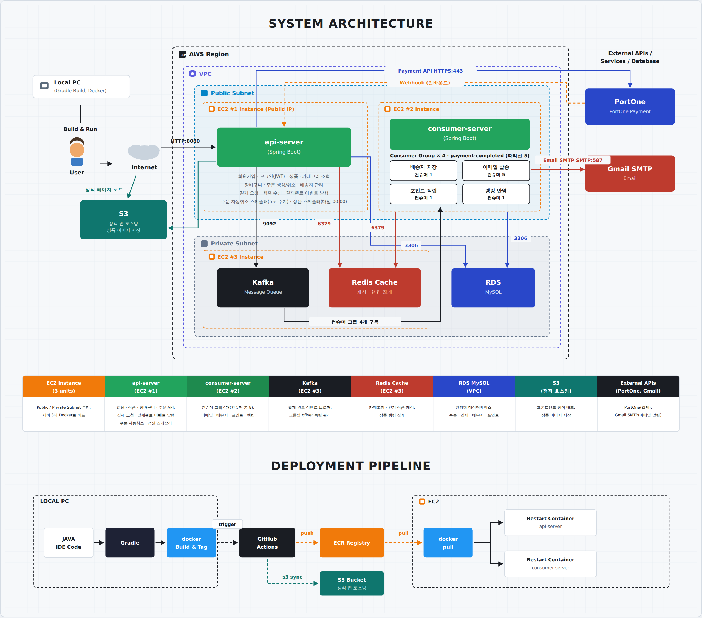
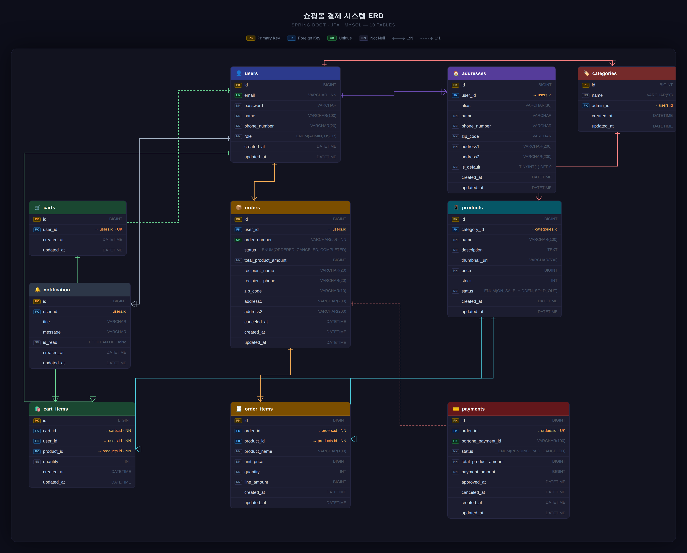

## 1. 프로젝트 소개
9신사는 Spring Boot 기반 종합 이커머스 쇼핑몰 백엔드입니다.
상품 조회 성능 개선, 결제 연동, 실시간 알림, 이미지 업로드 등
실제 쇼핑몰 서비스에 필요한 기능들을 도메인별로 나누어 구현했습니다.

## 2. 핵심 기능 요약

| 도메인 | 기능 |
|---|---|
| 회원 | 회원가입, JWT 로그인/로그아웃, 관리자/일반 사용자 권한 분리 |
| 상품 | 상품 목록/상세 조회, 카테고리별 필터링, 상품 이미지 업로드 |
| 카테고리 | 관리자 카테고리 관리, 고객용 카테고리 목록 조회 |
| 장바구니 | 상품 담기, 수량 변경, 전체 비우기 |
| 주문/결제 | 주문 생성, 결제 전 주문 취소, 미결제 주문 자동취소(스케줄러), PortOne 결제 연동/웹훅 처리, 일별 매출 자동 정산(스케줄러) 및 관리자 조회 |
| 알림 | 결제 완료 시 이메일 알림 발송 |
| 인기 상품 | 결제 완료 이벤트 기반 일일/주간 인기 상품 랭킹 |

## 3. 기술 스택

| 카테고리 | 스택 |
|---|---|
| Backend | Java 17, Spring Boot 4.1.0, Spring Data JPA, Spring Security, JWT |
| Cache | Caffeine, Redis |
| Message Broker | Kafka |
| Database | MySQL |
| 외부 연동 | PortOne, Gmail SMTP, AWS S3 |
| Infra | AWS EC2, RDS, ECR |
| Test | Postman, JUnit5, K6 |
| 협업 | Git, GitHub, Slack, Notion |
| IDE | IntelliJ IDEA |

## 4. 아키텍처



## 5. ERD



## 6. 실행 방법

### 사전 준비
- JDK 17
- Docker / Docker Compose
- 로컬 MySQL (3306 포트, `test` 데이터베이스)

### 실행 순서

```bash
# 1. Kafka, Kafka UI, Redis 컨테이너 실행
docker-compose up -d

# 2. src/main/resources/application.yml 에서 DB/메일/AWS S3/JWT 시크릿 값 확인 및 설정

# 3. 애플리케이션 실행
./gradlew bootRun
```

- Kafka UI: http://localhost:8088
- Redis: localhost:16379 (컨테이너 외부 노출 포트)

## 7. 프로젝트 구조

```
src
└── main
    └── java
        └── com/example/demo
            ├── domain
            │   ├── user           # 회원가입, 로그인, 내 정보 조회
            │   ├── auth           # JWT 로그인/재발급
            │   ├── address        # 배송지 등록/수정/삭제
            │   ├── category       # 카테고리 관리, 고객용 조회
            │   ├── product        # 상품 조회, 이미지 업로드
            │   ├── cart           # 장바구니
            │   ├── order          # 주문 생성/조회/취소
            │   ├── payment        # 결제 생성/승인/취소, 매출 정산, 관리자 결제 조회
            │   ├── portone        # PortOne 결제/취소/웹훅 연동
            │   └── ranking        # 결제 완료 이벤트 기반 인기 상품 랭킹
            └── common
                ├── config         # Security, Redis, Kafka, Mail 설정
                ├── entity         # 공통 Base 엔티티
                ├── exception      # ErrorCode, CustomException
                ├── response       # 공통 API 응답 포맷
                └── security       # JWT 인증/인가
```

## 8. API 명세

[API 명세](docs/api-spec.md)

## 9. 팀 소개

| 이름 | 역할 | GitHub |
|---|---|---|
| 이찬서 | Backend (알림, 인기 상품 랭킹) | @mavubsa3-dev |
| 이재석 | Backend (상품, 장바구니, 카테고리) | @Sole02 |
| 이동희 | Backend (주문, 결제, PortOne 연동) | @20LDH |

## 10. 커밋 컨벤션

`type : 제목` 형식을 따릅니다.

| Type | 설명 |
|---|---|
| feat | 새 기능 추가 |
| fix | 버그 수정 |
| refactor | 리팩토링 |
| docs | 문서 작성/수정 |

## 11. 브랜치 전략

`develop`에서 `feature/기능명` 또는 `fix/문제명` 브랜치를 생성해 작업하고, PR을 통해 `develop`에 병합합니다.

## 12. PR 템플릿 항목

- 작업 내용
- 변경 이유
- 주요 변경 사항
- 테스트 및 확인
- 리뷰 포인트
- AI 활용 기록

## 13. 기술 문서

기능별 상세 구현/개선 과정은 아래 문서에서 확인할 수 있습니다.

- [상품 목록 조회 인덱싱](docs/features/product/product-indexing.md)
- [카테고리 캐싱](docs/features/category/category-caching.md)
- [인기 상품 랭킹 단건 조회 캐싱](docs/features/ranking/findproduct-caching.md)
- [이메일 요청 처리량 개선](docs/features/notification/kafka-consumer%20group-seperation.md)
- [이메일 처리시간 단축](docs/features/notification/email-batch-optimization.md)
- [팀 브로셔](https://www.notion.so/teamsparta/Team9-9-3b92dc3ef51480918992e73473343ad6?source=copy_link)

## 14. 한계 및 추후 과제

- 배치 처리 / 컨슈머 그룹 분리 성능 및 처리속도를 각각 측정, 합친 결과 측정하지 못했습니다
  -> 두 대안을 합친 후 부하 단계를 높여 Consumer Lag이 회복되지 않고 쌓이는 한계지점 파악 및 성능개선을 고도화 예정입니다.

- 카테고리 캐싱을 개별 캐싱으로 개선했지만 캐시 무효화가 관리자 변경 이벤트에만 의존해 동시 다발적 갱신 상황에서의 정합성까지는 충분히 검증하지 못했습니다.
  -> 동시 갱신 상황을 재현하는 부하 테스트로 캐시 정합성을 검증하고, 필요 시 캐시 버전 관리나 이벤트 처리 순서 보장 로직 도입을 검토할 예정입니다.

- 현재 스케줄러는 정해진 주기에 따라 일괄 실행되는 구조기 때문에 실시간 데이터 변화나 작업 우선순위를 즉각 반영하지 못합니다.
  -> 작업 중요도와 데이터 변화에 따라 실행 주기를 조정하는 동적 스케줄링 구조로 고도화 예정입니다.
