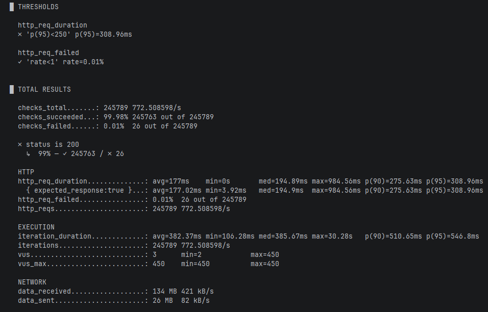
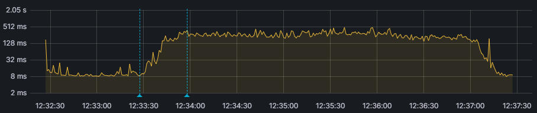
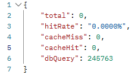
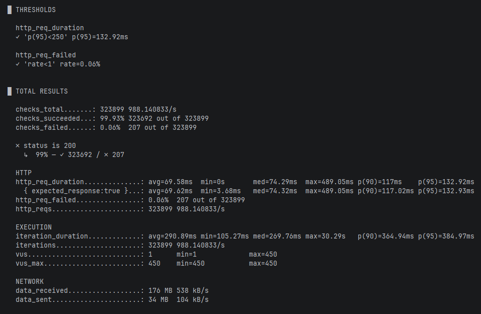
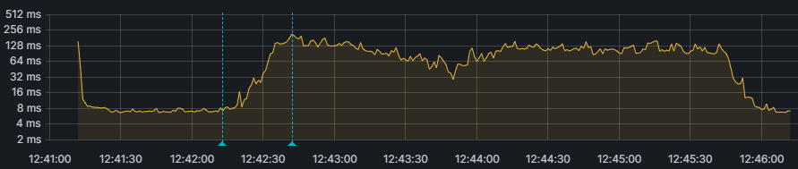
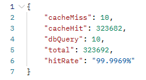

## Redis Hash 구조를 활용한 인기 상품 단건 조회 캐싱

### 적용 배경

인기 상품 목록은 사용자 유입이 많은 기능이고, 목록에서 상품을 눌러 들어가는 단건 조회 역시 그만큼 호출이 잦습니다.
반면 상품 정보는 관리자가 수정하거나 재고가 변동될 때만 바뀌는 데이터입니다.
조회는 잦고 변경은 상대적으로 드물어 캐싱에 적합하다고 판단해 도입했습니다.

### 문제 확인: 부하 테스트

캐시 도입이 실제로 필요한지 확인하기 위해, 인기 상품 목록에 속한 상품의 단건 조회 API를 대상으로 k6 부하 테스트를 진행했습니다.

**테스트 환경**

- CPU: AMD Ryzen 5 5600 6-Core Processor
- RAM: 32GB

**시나리오**

인기 상품 랭킹은 상시 트래픽이 높은 기능이므로, 점진적 증가 후 급증하는 패턴으로 구성했습니다.

| 구간 | 동시 사용자 |
| --- | --- |
| 0 ~ 30초 | 50명까지 점진적 증가 |
| 30초 ~ 1분 | 50명 → 100명 점진적 증가 |
| 1분 ~ 1분 30초 | 100명 → 450명 급증 (트래픽이 몰리는 상황 재현) |
| 1분 30초 ~ 4분 30초 | 450명 유지 |

**목표 기준**

p(95)는 일반적인 웹 성능 기준인 500ms를 그대로 쓰지 않고, 단순 단건 조회임을 고려해 250ms로 설정했습니다.
에러율은 일반적으로 허용하는 1%를 기준으로 정했습니다.

**결과**

| 항목 | 결과 |
| --- | --- |
| 요청 처리량 | 772/s |
| failed(실패율) | 0.01% |
| avg(평균 응답시간) | 177ms |
| max(최대 응답시간) | 984.56ms |
| p(95) | 308.96ms |

트래픽이 급증하는 1분 지점인 첫 번째 파란색 선 기준으로 트래픽이 증가하며 병목이 시작됐고, 최대 부하가 유지되는 1분 30초 지점인 두 번째 파란색 선 기준으로
데이터베이스가 부하를 견디지 못하며 p(95)가 목표치 250ms를 초과했습니다.

데이터베이스 조회를 줄여 부하를 낮추고 응답 속도를 개선하는 것을 목표로 캐시 도입을 결정했습니다.

### 해결 방안: Redis Hash + Cache-Aside

**자료구조 선택: String(JSON) vs Hash**

| | String (JSON 직렬화) | Hash |
| --- | --- | --- |
| 부분 조회 | 전체를 읽어 역직렬화 필요 | HGET으로 필요한 필드만 |
| 부분 수정 | 읽기 → 수정 → 쓰기 3단계 | HSET 한 번 |
| 동시 수정 | 서로 다른 필드를 고쳐도 갱신 유실 가능 | 필드 단위 원자성으로 유실 없음 |
| 수량 증감 | 애플리케이션에서 계산 후 덮어쓰기 | HINCRBY로 원자적 증감 |

상품 캐시는 재고·판매 수량·상품 상태처럼 일부 필드만 빈번하게 바뀝니다.
String에 JSON을 저장하면 필드 하나를 갱신할 때도 전체를 읽어 수정한 뒤 다시 써야 하고,
그 사이에 다른 요청이 끼어들면 먼저 반영된 변경이 덮어써질 수 있습니다.

Hash는 HSET·HINCRBY가 필드 단위로 원자적으로 동작하므로 이 문제가 구조적으로 발생하지 않고,
직렬화·역직렬화 비용도 들지 않기에 이를 근거로 Hash를 선택했습니다.

**캐시 전략: Cache-Aside**

상품 조회는 읽기가 대부분인 기능이라, 한 번 데이터베이스에서 가져온 데이터를 캐시에서 계속 재사용할 수 있는
Cache-Aside 패턴이 적합하다고 판단했습니다.

또한 인기 상품은 정보나 수량 변경이 자주 일어날 수 있어 정합성 관리가 중요합니다.
Cache-Aside는 캐시 무효화 시점을 애플리케이션이 직접 제어하므로,
상품 수정 시 해당 캐시를 즉시 삭제해 정합성을 직접 관리하도록 구현했습니다.

### 성과

| 항목 | 캐시 도입 전 | Redis Hash 도입 후 | 비교 |
| --- | --- | --- | --- |
| 요청 처리량 | 772/s | 988/s | 약 28% 증가 |
| failed(실패율) | 0.01% | 0.06% | 소폭 증가 (기준 1% 이내) |
| avg(평균 응답시간) | 177ms | 69.58ms | 약 61% 감소 |
| max(최대 응답시간) | 984.56ms | 489.05ms | 약 50% 감소 |
| p(95) | 308.96ms | 132.92ms | 약 57% 감소 |

- **응답 속도**: p(95)가 308.96ms에서 132.92ms로 약 57% 감소하며 목표치 250ms를 통과했습니다.
- **데이터베이스 부하**: 조회 건수가 245,763건에서 10건으로 약 99% 감소했습니다.
- **처리량**: 772/s에서 988/s로 약 28% 증가해 더 많은 요청을 감당할 수 있게 되었습니다.

### 결론

부하 테스트로 데이터베이스가 한계에 도달하는 지점을 먼저 확인하고, 그 지점을 캐시로 해소하는 순서로 접근했다.
그 결과 응답 속도 개선(p95 약 57% 감소)과 데이터베이스 부하 감소(조회 약 99% 감소)라는
캐시 도입의 두 목적을 모두 달성했다.

이 과정에서 캐시가 단순히 속도를 높이는 도구가 아니라,
데이터베이스를 보호하고 서비스 안정성을 높이는 전략적 설계라는 점을 확인했다.
또한 자료구조 선택과 정합성 전략을 정리하면서 초기 설계 단계의 판단이 이후 작업량을 크게 좌우한다는 것을 체감했다.
